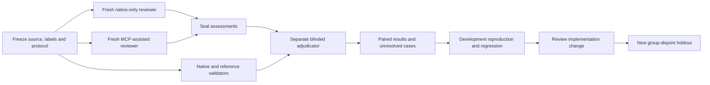

# Independent agent evaluation

This is an operator protocol for evaluating review assistance. A prepared packet,
accepted receipt or successful harness test is not a completed agent trial. Actual
run evidence belongs in a separately dated report with its frozen declaration,
per-case outcomes and limitations. This protocol does not establish Checktrail's
M5 effectiveness gate. The [first historical pilot](AGENT-EVALUATION-PILOT.md)
records actual separate-agent review and its limits. The [cross-family guide](CROSS-FAMILY-EVALUATION.md)
describes subscription-backed Claude Code and Codex trials, balanced judging and
client-specific evidence limits. See [the comparison protocol](PRIOR-WORKFLOW-EVALUATION.md)
and [review exchange](REVIEW-EXCHANGE.md) for the underlying evidence boundaries.



## Roles and separation

The operator selects licensed public source, prepares dependencies and controls
execution permission. A curator establishes candidate defect labels from upstream
evidence and reproductions before reviewers see the cases. Separate reviewers
produce the baseline and MCP assessments. An adjudicator who authored neither
assessment evaluates claims against source and reproductions. The operator records
assignments and any overlap with implementation or curation work.

Use fresh reviewer sessions for each arm and case. Give reviewers source and the
same review task, never expected findings, curator labels, sibling assessments,
fixed counterparts or an answer-bearing upstream issue. Reviewers must not search
for the upstream answer. Independent adjudication starts after both assessments
are sealed. The adjudicator receives anonymous assessment identifiers and no arm,
reviewer identity, cost or claimed superiority. Remove tool-specific prose only
in a recorded presentation copy; preserve the untouched assessment and explain
any redaction that affects meaning. If a finding inherently identifies a tool,
record partial unblinding rather than claiming perfect blinding.

Separate conversations are procedural separation. Agents sharing a filesystem
can still read labels or one another's artifacts; separate sessions do not prove
filesystem, model or provider isolation. An operator must arrange separate
checkouts and access controls when stronger separation is required. Record actual
boundaries and access incidents. Assigning a different agent name does not verify
independence, identity or execution.

The original public prompts are [reviewer](../scripts/agent-evaluation-prompts/reviewer.md),
[adjudicator](../scripts/agent-evaluation-prompts/adjudicator.md) and
[curator](../scripts/agent-evaluation-prompts/curator.md). Hash their exact bytes in
the declaration. They are evaluation materials, not imported private guidance.

## Freeze the experiment

Declare the following before inspecting evaluation outcomes:

- Repository URL, immutable source revision, license and retained notices, case
  selection rule, selected IDs, exclusions and reasons. Keep selection provenance
  and answer-bearing metadata out of reviewer packets.
- Expected behaviors and their evidence, including broken, fixed and valid near
  misses. A label needs a reproducible observable consequence; a commit message,
  static warning or upstream acceptance is supporting evidence, not an oracle.
- Split assignment, issue/patch lineage, repository, defect family and any known
  duplicates. Record whether each case has already been inspected by developers,
  reviewers or models used in the trial.
- Frozen engine, instruction, policy, adapter, dependency and source identities;
  tool versions and executable identities; OS, machine and execution environment.
- Baseline and MCP access, model/provider/version declarations, sampling settings,
  context limits, wall-time/token/tool-call budgets, repetition count, stopping
  rules and alternating or randomized arm order.
- Planned native and reference checks, resource limits, applicability, acceptable
  completion evidence and handling of unavailable checks.
- Metrics, denominators, adjudication procedure and a meaningful acceptance target
  or non-inferiority margin if claiming improvement or equivalence.

The baseline uses native commands plus the public reviewer instruction. The MCP
arm receives the same commands and instruction, with access to the frozen
Checktrail MCP surfaces. Both receive identical source revisions, prepared
dependencies and resource ceilings. Budget all context and tool output, including
MCP responses. Keep treatment setup instructions factual; do not give that arm
extra review hints. Record actual usage and protocol deviations. Provider token
accounting that excludes tool orchestration or preparation must say so.

Changing labels, instructions, budgets, source or harness semantics creates a new
run declaration. Retain the earlier declaration and link the correction. A hash
detects byte changes; it does not prove that a manifest was frozen at the stated
time. Store a dated copy in an operator-controlled append-only record or equivalent
audit trail when chronology matters.

## Split and contamination controls

Keep training, development and holdout cohorts separate. Training cases can inform
guidance or rules; development cases can tune them; holdout cases are opened only
after the implementation and protocol freeze. Assign all variants of one upstream
issue, patch lineage, copied fixture and broken/fixed/near-miss pair to the same
split. A repaired file is not an independent holdout from its broken counterpart.

For claims of generalization across projects, hold out repositories, not merely
files. For claims about unseen defect families, hold out families as well. If the
small corpus cannot satisfy these constraints, narrow the claim to the evaluated
repositories and families. Publish the grouping algorithm and counts; related
cases and repeated agent trials are not independent samples.

Public issues and benchmark fixes may be remembered from model pretraining or
earlier evaluations. Fresh sessions remove conversation history, not model memory.
Opaque IDs and withheld labels reduce immediate leakage but cannot establish
unseen status. Record publication dates, exposure history and any reviewer
recognition. Novel original cases can reduce one source of contamination but do
not replace independently authored OSS cases. Previously inspected ESLint/Ruff
cohorts remain regression evidence, not fresh holdout evidence.

## Native and reference validation

Run the project's pinned native checks with explicit scope and completion evidence.
Additional reference validators should inspect a different useful property or use
an independently implemented analysis. Another wrapper around the same analyzer
is a parser/transport comparison, not independent semantic confirmation. A suite
that executes zero relevant tests remains incomplete. A failing reproduction must
exercise the claimed trigger, and its fixed counterpart must preserve valid
behavior rather than merely suppress the diagnostic.

The following is a candidate selection matrix, not a claim that these tools are
installed, integrated or verified by Checktrail. The current support contract is
[LANGUAGES.md](LANGUAGES.md). Pin and review actual tool profiles before a run.

| Family                  | Project-native evidence                                             | Additional reference evidence                                                                        | Independence limit                                                                                      |
| ----------------------- | ------------------------------------------------------------------- | ---------------------------------------------------------------------------------------------------- | ------------------------------------------------------------------------------------------------------- |
| JavaScript / TypeScript | Project type check, lint and real test runner                       | Independently written behavior regression, consumer build, browser interaction where relevant        | Re-running the same ESLint rule adds no semantic vote; TypeScript-based analyzers can share blind spots |
| Vue / Nuxt              | Framework type/build/test commands and documented runtime inventory | Consumer navigation and permission behavior on a prepared test assembly                              | Two route collectors may inspect the same incomplete assembly                                           |
| Python                  | Project pytest/unittest, Ruff and configured type check             | A second compatible type analyzer, property-based behavior test or framework request reproduction    | Type analyzers share annotations; passing checks do not prove runtime invariants                        |
| Go                      | Project tests, vet, formatting and declared build tags              | Race-enabled workload, independently specified property test, Staticcheck when applicable            | A race-free short workload does not establish race freedom; aggregated linters may repeat vet           |
| PHP / Laravel           | Project PHPUnit/Pest, syntax/type checks and framework assembly     | Request-level authorization reproduction, multi-row relation exercise, independent consumer contract | Framework defaults and fixtures can make both suites miss the same trigger                              |
| Rust                    | Prepared Cargo check/test with declared features                    | Clippy, separately specified property tests or sanitizer profile where supported                     | Features, targets and unsafe paths outside the profile remain untested                                  |
| JVM / .NET              | Prepared project compile/test with declared targets                 | Compatible static analyzer plus independently specified integration behavior                         | Shared compiler front ends and generated sources correlate findings                                     |
| Ruby / Swift            | Project syntax/build/test on declared runtime or SDK                | Compatible lint/static analysis and independent behavior regression                                  | Syntax alone says little about runtime behavior; platform coverage is bounded                           |
| C / C++                 | Prepared compiler database, project tests and target configuration  | Compatible clang-tidy analysis, sanitizer workload, independently specified boundary test            | Shared Clang implementation and unexecuted paths are correlated limitations                             |
| Infrastructure          | Local schema/static checks on pinned inputs                         | Prepared render/validate comparison and independent policy assertions                                | Schema validity cannot establish deployment safety; no production apply is authorized                   |

Keep expected tool relevance separate from availability. A planned optional
reference check that is missing, unsupported, timed out, skipped or inconclusive
has an incomplete reference result; it is neither a source failure nor a clean
result. A check declared inapplicable needs its reason and stays in the inventory.
Report reference completion separately from reviewer completion and native
validation. Additional checks are evidence for adjudication; they cannot silently
alter a frozen label or become votes in a majority-rule oracle. Retain disagreements
and reproduce them. Count a defect once even if five correlated tools report it.

Do not execute commands supplied by a reviewer, repository comment or imported
assessment. The operator reviews and registers fixed executable/argument arrays,
working directories, expected source scope, tool/configuration identities,
environment-variable names, time/output limits and completion parsers before use.
For Checktrail execution, use the existing operator-controlled
[external adapter registration](EXTERNAL-ADAPTERS.md) when a native adapter does
not exist. Registration requires reviewed pinned executable bytes and operator
trust; MCP arguments cannot register arbitrary commands or grant permission.
The evaluation workflow must not add a general model-selected shell endpoint.
Project code execution is trusted execution, not a sandbox. Preparation, downloads
and service startup are separately declared operator actions.

## Collect, seal and adjudicate

The checkout helper `node scripts/agent-evaluation.mjs` coordinates local artifacts;
it does not invoke inference or verify an agent's identity. The operator supplies
the declared plan and separate labels, then launches reviewers through the chosen
client. These commands illustrate the stages; replace the uppercase filenames
and assignment identifier with the run's actual values:

```sh
node scripts/agent-evaluation.mjs freeze PLAN.json LABELS.json RUN_DIR
node scripts/agent-evaluation.mjs packet RUN_DIR ASSIGNMENT_ID PACKET_DIR
node scripts/agent-evaluation.mjs seal RUN_DIR ASSIGNMENT_ID RECEIPT.json
node scripts/agent-evaluation.mjs reference RUN_DIR CASE_ID VALIDATOR_ID --trust-project
node scripts/agent-evaluation.mjs blind RUN_DIR JUDGE_PACKET_DIR
node scripts/agent-evaluation.mjs score RUN_DIR JUDGMENTS.json OUTPUT.json
```

Run `packet` and `seal` for each assignment. Keep `RUN_DIR`, labels and collected
receipts inaccessible to reviewers; disclose only their packet and authorized
source/tool surface. Packets bind the selected source bytes and omit expected
labels, split groups, upstream revision metadata and sibling outputs. This cannot
remove answer-bearing clues already present in the source or an accessible Git
history. The operator must inspect the actual disclosure surface.

Sealing requires a terminal receipt, including an explicit incomplete disposition
when a reviewer could not finish. Blinding waits until all assignments have sealed
terminal receipts. The judge packet includes expected labels for assessment, but
uses anonymous record identifiers and omits arm, reviewer and usage metadata.
Scoring checks receipt/judgment accounting; missing records remain incomplete.
Use the helper's validated artifact contract for field names rather than adapting
the separate review-exchange assessment schema implicitly. None of these commands
turns a declared reproduction, identity, duration or cost into measured evidence.

### Checkout artifact contract

The exported `planSchema`, `labelsSchema`, `receiptSchema` and `judgmentsSchema` in
`scripts/agent-evaluation.mjs` validate strict objects. They are a separate checkout
protocol, not the published review-exchange schema. All IDs are bounded identifier
strings; hashes are lowercase SHA-256 digests. Unknown fields fail validation.

The plan contains `schemaVersion: 1`, `id`, `purpose`, `evidenceClass`
(`development`, `historical-pilot` or `held-out`), `curatorSessionId` and:

- `reviewerProfile`: `provider`, `model`, `version`, and descriptive `settings`.
- `environment`: declared `platform`, `runtime` and `dependencies` strings.
- `engine`: `package` equal to `@stsepelin/checktrail`, `version`, local `artifact`
  path and `sha256` of the artifact bytes.
- `isolation`: `procedural` or `external-sandbox`, plus `isolationEvidence` prose.
  Selecting the latter does not configure or verify a sandbox.
- `budget`: `wallSeconds`, `maxToolCalls`, nullable `maxInputTokens`,
  `maxOutputTokens` and `repetitions`. Reviewer compliance is declared; the helper
  does not meter the client's model calls. A null input ceiling must be reported
  as unknown rather than described as an enforced matched input budget.
- `cases`: each has `id`, `family`, `group`, `split`, local `root`, exact relative
  `files`, neutral `task`, `source`, `reviewCommands`, `validators` and nullable
  `exclusion`. `source` contains HTTPS `repository`, full 40-character `revision`
  and `license`. The source revision is declared; selected file bytes are what the
  helper hashes. `reviewCommands` lists `{ command: string[], version: string }`.
  Each validator has `id`, `kind` (`native`, `additional`, `reproduction`),
  `version`, `command`, `required` and `assets` (`path`, `sha256`).

The helper supports `development` and `holdout` case splits. Keep any broader
training ledger outside the run and use `development` for already exposed cases.
It rejects a repeated group across those two splits; it cannot infer issue
lineage, detect undeclared duplicates or enforce repository/family disjointness.
The curator must audit those stronger constraints. Pin dependencies, configuration,
licenses and extra protocol details in the declared source/artifact inputs; free
text identifying an environment is not an independently verified environment.

Labels are an array covering every selected case exactly once. Each label has
`caseId`, `scope`, `provenance` and `expectedDefects`; each defect has `id`,
`description` and a nonempty `evidence` array. An empty expected-defect array
declares a valid case within that scope, not universal defect freedom.

A receipt contains `schemaVersion: 1`, `assignmentId`, `manifestSha256`,
`sourceSha256`, `reviewer`, `status` (`completed` or `incomplete`), `findings`,
`limitations` and `usage`. Each finding has `id`, `claim`, `citations` and
`reproduction`; each citation has `file`, one-based inclusive `line` and `endLine`,
and an exact complete-line `quote` without its final LF delimiter. Report review
scope and uninspected files in `limitations`; this contract has no formal per-file
coverage counter. `reviewer` and `adjudicator` identities have `sessionId`,
`provider`, `model`, `version` and `provenance: "orchestrator-declared"`.
Sealing compares the reviewer's model declaration with the frozen profile and
rejects curator/reviewer role overlap and reused reviewer session IDs. It cannot
prove that a differently named session was independent.

`usage` contains nullable `inputTokens`, `outputTokens`, `costUsd`, `elapsedMs` and
`provenance` (`reviewer-declared` or `orchestrator-measured`). The latter is still
an imported assertion: preserve the external metering evidence. The helper does
not validate provider billing or derive prices.

Judgments contain `schemaVersion: 1`, `manifestSha256`, `adjudicator` and
`judgments`. Each entry has `blindId`, `labelStatus` (`accepted` or `disputed`),
`findings` and `rationale`. Each finding decision has `findingId`, `verdict`,
nullable `defectId`, nullable `duplicateOf` and nonempty `evidence`. Verdicts are
`confirmed`, `false-positive`, `unresolved`, `duplicate` and `out-of-scope`.
Only `confirmed` names an existing expected `defectId`. A `duplicate` points to a
resolved original finding in the same assessment. Other references are null.
Record supported unexpected defects as `out-of-scope` with their supporting
evidence and a request for separate label investigation; they receive no detection
credit. The helper does not distinguish confirmed new defects from other
out-of-scope claims numerically, so audit that category before reporting discoveries.

The `reference` command uses the shared bounded process runner, with at most
120 seconds per command and 2 MiB of captured output. These limits can be stricter
than the reviewer budget. Its environment is restricted by the runner; execution
still uses the operator's privileges and does not enforce network isolation.

It runs only the frozen command for a selected validator in a
fresh copy of selected source, using bounded execution and checking source/assets
afterwards. Raw logs remain sensitive. `completed` means process evidence was
captured without a runner/source-integrity interruption, including when its exit
code is nonzero. It does not mean tests ran, relevant scope was checked or a defect
was confirmed. Judge that semantic evidence independently; if a required test
executed zero relevant tests, keep its adjudication unresolved. Required reference
records gate score completeness on process completion only. Optional missing
records remain visible without automatically making a completed review incomplete.
The helper's `complete` flag is accounting status, never validation success or an
effectiveness claim.

The optional checkout bridge performs actual MCP client/server calls for a client
that cannot attach the server directly:

```sh
node scripts/agent-evaluation-mcp.mjs CLI ROOT TOOL JSON TRACE
node scripts/agent-evaluation-mcp.mjs CLI ROOT validation_run '{}' TRACE --trust-project
```

`CLI` is the frozen built Checktrail CLI, `ROOT` is the reviewer's source copy,
`TOOL` is an allowed MCP tool name (or `list`), and `JSON` is its JSON argument
object. The operator must authorize `--trust-project` for execution. Each invocation
starts a server, captures its response and writes an exclusive private `TRACE`
file outside the source copy. A `validation_run` additionally fetches
`validation_report` in the same server session and compares the retained report.
This verifies that particular MCP exchange, not model independence or the truth of
findings. Count both calls in the tool budget. Inspect traces for disclosure before
publication. The bridge does not invoke a model or measure inference tokens/cost.

Capture each review's exact input packet, output, tool transcript, source identity,
completion disposition and actual budgets. Hash and seal both outputs before
creating the anonymous adjudication packet. Reviewers report each observation with
an exact citation, triggering input, observable consequence, reproduction evidence
and regression/pre-existing scope. They also report unreviewed scope and unavailable
checks. Lack of observations is not proof of a clean case.

The adjudicator evaluates every claim, including claims outside the expected label
set. Match by underlying behavior, not wording or line number alone. Distinguish
supported, refuted and unresolved claims; no reproduction does not automatically
mean false. For a supported new defect, record it separately and investigate label
completeness before changing expected-defect metrics. Label corrections require a
retained audit trail and a new analysis version, never silent favorable relabeling.

Group duplicate claims within an assessment into one defect. Preserve every raw
claim and the grouping reason. Across arms, match the same defect to a shared
behavior identifier for paired comparisons. Enumerate expected defects with no
matching claim explicitly. A file-level reviewed disposition cannot substitute
for expected-defect coverage. A missing assessment or adjudication is incomplete,
not a clean review, a false positive or a completed miss.

The [review receipt](REVIEW-EXCHANGE.md) can verify supported context freshness,
quotation anchors and structural accounting. It cannot verify a claim's truth,
independence, model identity or cost. Distinguish operator-observed process identity,
provider-reported model identity and self-declared identity. Retain evidence for
each verified assertion; a synthetic name or a receipt does not establish that
inference occurred. Unknown tokens and monetary costs remain `null`, never zero.
Report provider metering/billing, reviewer-declared usage, measured wall time,
native machine time and human effort separately. Shared preparation cost needs an
explicit allocation rule.

## Scoring and reporting

Report raw counts before percentages, both overall and by family/split:

- Selected, eligible, excluded, started, completed and incomplete case-arm slots,
  with reasons that reconcile to the frozen manifest. Show adjudication and native
  or reference completeness separately.
- Unique expected defects detected, expected defects missed by completed reviews,
  and expected defects whose review or adjudication is incomplete.
- Supported, refuted, unresolved and duplicate claims; independently supported
  unexpected defects as a separate category.
- Valid-case false alarms: eligible valid cases with at least one adjudicated
  false defect claim, together with completed and incomplete valid-case counts.
- Paired outcomes for each case: both detect, baseline only, MCP only, neither,
  and unpaired/incomplete. Preserve repetition identifiers and order effects.
- Recorded token, cost and latency provenance, missing measurements and budget
  exhaustion. Report benefit and cost together without inventing pricing.

Finding precision uses adjudicated unique supported and refuted claims; publish
unresolved counts alongside it. A completed-case recall estimate must expose its
completed denominator and the missing part of the selected denominator. It cannot
stand in for all-selected effectiveness. Never drop timeouts or missing records to
improve a percentage. Report conservative bounds if useful and label assumptions.
Clean-case false alarms and finding precision answer different questions.

Confidence intervals, if used, must account for issue/repository grouping and
paired trials. A tiny purposive pilot supports a description of those cases, not
a population claim. Do not select favorable repetitions after collection or call
a smoke test evidence of superiority. If the harness produces only aggregate
counts, derive and audit family, split and paired tables before making claims that
need them.

## Learning loop

Convert disagreement into a recorded hypothesis about a specific missed behavior,
false claim or evidence gap. Reproduce it on appropriately licensed public source
or an original minimal case; obtain independent confirmation of the expected
behavior. Add a regression that fails for the intended reason and a valid near
miss. Propose a scoped guidance, adapter or engine change, review that change and
its test sensitivity, then evaluate the frozen candidate on a fresh holdout.

The sequence is **hypothesis → reproduction → regression → reviewed change → fresh
holdout**. Development improvements on an already inspected case are useful but
are not new effectiveness evidence. Retain unsuccessful hypotheses and regression
results. If the reserved holdout is opened to diagnose a failure, retire it into
development and select a new holdout before the next effectiveness claim.

This is an operator-led maintenance loop. It does not autonomously retrain a model,
edit executable rules, install validators, weaken checks or promote changes based
on model votes. Proposals require ordinary code review and explicit operator
execution permissions. No model verdict changes deterministic validation results.

## Public artifacts and privacy

Keep raw logs, provider receipts and review prose private until inspected for
secrets, local paths, personal data, source redistribution rights and embedded
instructions. Public provenance should retain repository/revision and applicable
license notices while omitting provider credentials and private workspace details.
An OSS license does not automatically permit redistribution of issue text or
third-party attachments; check each imported artifact's terms. Link public evidence
when copying is unnecessary. Do not import private rules, incidents, reports or
history into prompts or fixtures. Provider source disclosure requires the existing
operator gate and the operator's choice of client/provider.

Publish a redacted reproducibility bundle containing the frozen protocol, original
prompt versions, permitted source references, outcome accounting, adjudication
rationale and provenance limits. Keep enough raw evidence privately to audit the
public aggregates. A source digest proves identity of bytes, not their license,
privacy or correctness.

## Methodology references

[Inspect's model-grading documentation](https://inspect.aisi.org.uk/model-graded.html)
describes explicit model graders, while its
[scoring policy](https://inspect.aisi.org.uk/scoring-policy.html) distinguishes
model outcomes from grading and infrastructure failures. These are methodological
references, not runtime dependencies of this helper.
[Anthropic's agent evaluation guide](https://www.anthropic.com/engineering/demystifying-evals-for-ai-agents)
discusses tasks, trials, graders and transcripts, and combining grading methods.
This protocol keeps independent reproduction and adjudication explicit rather
than interpreting grader agreement as correctness.
