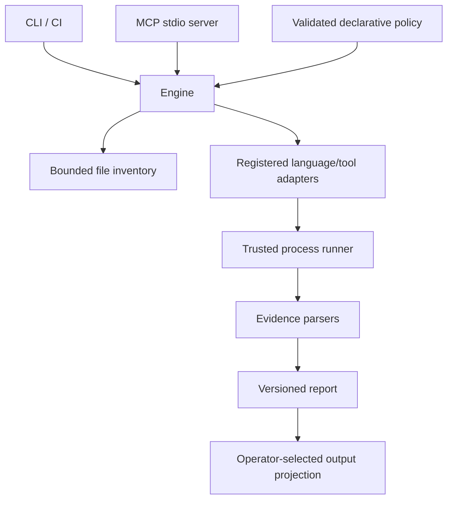

# Architecture

The engine owns discovery, planning, execution accounting and report construction.
Adapters describe checks and parse results; they do not write protocol messages.
CLI and MCP call the same functions. stdout belongs exclusively to JSON or MCP;
diagnostics go to stderr. The engine does not call an LLM.

## Discovery and scope

The root is configured by the operator, canonicalized once, and never supplied by
an MCP tool call. Inventory is deterministic, bounded, excludes dependency/build
directories and sensitive local files, and does not follow symlinks. Read errors
are errors, not silently empty inventories. Scope exclusions accompany results.

Checks validate whole discovered project units. Optional operator-selected Git
base comparison narrows projects through an explicitly declared complete dependency
graph, with full-plan fallback whenever impact is uncertain. See `WORKSPACES.md`.
Persistent caching is not implemented. An inventory fingerprint
identifies included file contents; it is not a claim about ignored dependencies,
outside files, runtime services or hermetic reproducibility.

## Configuration

`repo-verifier.json` is optional and uses `schemaVersion: 1`. It can select known
checks for detected project roots. Unknown keys, IDs and project roots fail before
any process starts. A missing config uses conservative registered defaults. Pinned JSON packs add
registered checks, and an operator-selected private overlay adds requirements to
an explicit base policy. See `POLICY-PACKS.md`.
Local operator trust and output settings cannot be enabled by this file. Projects
can require named environment variables, but values are supplied only through
operator CLI/library/MCP startup permissions. Values are not recorded in commands;
detailed reports retain names and a fingerprint. See `ENVIRONMENTS.md`.

## Execution and results

Commands are executable/argument arrays with no shell interpolation. A required
check gets one terminal result. Aggregate status is failed if any check fails,
incomplete if any required check lacks a conclusive result, otherwise passed.
An empty plan is incomplete. The report retains both failures and incomplete work.

Test results need evidence of at least one executed non-skipped test. Missing or
unparseable evidence is inconclusive even if the process exits zero. Successful
format checks need no diagnostics. A process failure cannot be converted into a
pass by a parser. Source changes during execution invalidate a green result.

Use bounded process output and timeouts, terminate the process group on supported
POSIX hosts, and propagate cancellation. No automatic dependency installation,
source rewriting, infrastructure startup, deployment or repository mutation.
Executed project code still has the process user's privileges; this is not a
sandbox. Tests may modify files or access networks and must be trusted accordingly.

## MCP boundary

Expose `project_context`, `validation_plan`, `validation_run`, `validation_report`,
`finding_comparison`, `runtime_comparison`, `contract_validation`,
`architecture_validation`, `review_guidance`, `review_context`, `review_receipt`,
and `mutation_experiment`.
Tool schemas are validated. Execution is disabled unless enabled when starting
the server. Keep a bounded in-memory report store; report IDs are opaque and a
restart clears them. The optional library-only [task store](TASK-STORAGE.md)
retains projected reports in bounded, exclusively owned SQLite databases. It is
not connected to these tools. The separate [library worker](VALIDATION-TASKS.md)
owns the store while executing through the shared engine and cancels on parent
disconnection. MCP Tasks integration remains pending.
Request cancellation is matched by exact ID, including numeric zero. Connection
closure and process signals terminate active validation workers. The
[compatibility record](MCP-COMPATIBILITY.md) describes the SDK constraints and
standard Tasks acceptance gates.

Default summary output contains aggregate counts, adapter/check IDs and statuses;
it omits source excerpts, paths, commands and raw logs. Detailed output requires a
startup flag and is intended for trusted clients. Both can reveal project activity;
neither is a guarantee against the MCP client's own data handling.

## Extension boundaries

Public rule packs, private overlays and tool adapters share stable schemas.
Built-in checks and operator-registered external checks execute through the shared
runner. Local data-only packs use pinned content integrity and bounded reads; public
profiles are included in the package. External executable bundles require a manifest
digest and per-file digests; verified bytes are copied into an owned temporary
directory. Their JSON protocol accounts for every planned file and labels delegated
tool identities as adapter-reported. See `EXTERNAL-ADAPTERS.md`. An explicit CLI/library HTTPS fetch operation installs
pinned data-only packs without activating them; planning, validation and MCP remain
offline with respect to pack loading. See `PACK-DISTRIBUTION.md`. Remote executable
bundle distribution, sandboxing and dependency resolution remain separate work. Advisory guidance is never serialized as a passed
automated check.

Native framework capture is opt-in and uses version-gated collectors. The Vue Router
profile constructs a selected testing router, awaits registration and verifies native
URL resolution with complete route-record participation. Its assembly projection
and limits are documented in `VUE-ROUTER.md`. The separate Nuxt profile builds
a fresh SSR testing assembly and captures its native router after in-process
requests complete, without a listening socket; see `NUXT.md`.

## Advisory assistance

Guidance selects built-in public questions by exact check/topic triggers without
executing code. Mutation experiments use the shared validator in bounded fresh
copies, preserving baseline and changed-test evidence. Both have separate advisory
schemas and cannot rewrite deterministic outcomes. The initial mutation profile
is limited to dependency-free Node projects with flat tests; see `GUIDANCE.md` and
`MUTATIONS.md`. No model call or source upload is required.

Optional review exchange captures explicitly selected source and receives external
assessments without invoking a model. Source and review prose require a separate
operator disclosure setting. Context identity, freshness, quotations and declared
file accounting are checked, while defect claims remain unverified and separate
from validation. See `REVIEW-EXCHANGE.md`.
