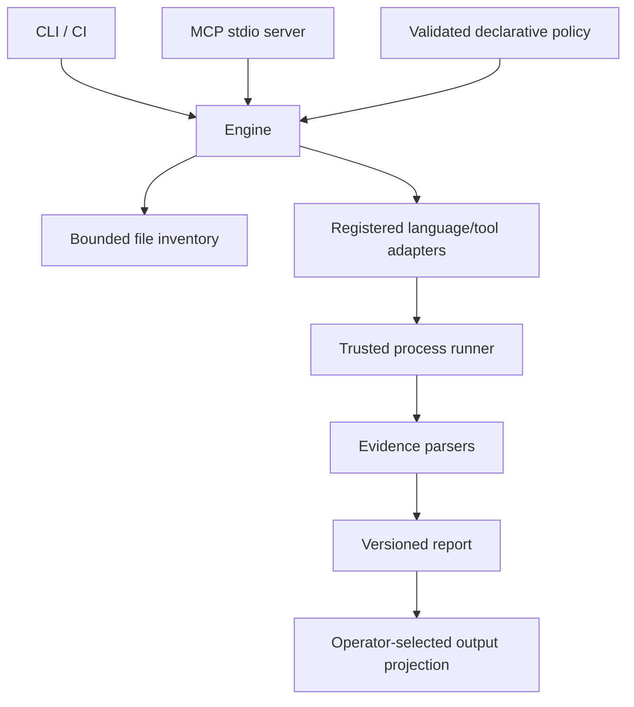

# Architecture

```mermaid
flowchart TD
  CLI[CLI / CI] --> Engine
  MCP[MCP stdio server] --> Engine
  Policy[Validated declarative policy] --> Engine
  Engine --> Inventory[Bounded file inventory]
  Engine --> Adapters[Registered language/tool adapters]
  Adapters --> Runner[Trusted process runner]
  Runner --> Evidence[Evidence parsers]
  Evidence --> Report[Versioned report]
  Report --> Output[Operator-selected output projection]
```

The engine owns discovery, planning, execution accounting and report construction.
Adapters describe checks and parse results; they do not write protocol messages.
CLI and MCP call the same functions. stdout belongs exclusively to JSON or MCP;
diagnostics go to stderr. Deterministic validation does not call an LLM; optional
advisory assignments can be exchanged with a host-owned AI without engine
inference. Optional direct API inference requires separate operator grants.

## Reviewer run budgets

Optional operator provider configuration can select one aggregate admission
budget per verification run. An engine-owned ledger spans both independent API
assignments and all retries; it is never included in the model packet. Standalone
review/refutation gets a fresh ledger for that invocation. Retained reports bind
the shared ID, exact earlier attempts, numeric usage and transport-body bytes.
Version 2 and 3 native probe receipts bind one call/output ledger across fresh
cases, with shrinking output allowances and every reached/unrun case retained.
Version 3 additionally retains bounded physical process stdout/stderr and replays
valid worker observations; summaries and independent model packets omit those
private artifacts. See [NATIVE-RAW-EVIDENCE.md](NATIVE-RAW-EVIDENCE.md).
Verification binds it to frozen operator startup limits and stops before later
adjudicator disclosure when native evidence is incomplete. Delivered chunks can
exceed retention ceilings before cancellation. Wider native/tool and optional provider
profiles remain open. See REVIEW-PROVIDERS.md and REVIEW-PROBES.md for limits and
unverified ceilings. The neutral workflow separately enforces protected engine
epoch, assignment, packet, response, retained-payload and wall admission. Host
model calls/tokens/billing remain outside these engine budgets. See
REVIEW-MCP-WORKFLOW.md for the meters and default ephemeral lifecycle; REVIEW-WORKFLOW-AUDIT.md describes opt-in private command persistence.

## Discovery and scope

The root is configured by the operator, canonicalized once, and never supplied by
an MCP tool call. Inventory is deterministic, bounded, excludes dependency/build
directories and sensitive local files, and does not follow symlinks. Read errors
are errors, not silently empty inventories. Scope exclusions accompany results.

Checks validate whole discovered project units. Optional operator-selected Git
base comparison narrows projects through an explicitly declared complete dependency
graph, with full-plan fallback whenever impact is uncertain. See `WORKSPACES.md`.
Persistent caching is not implemented. An inventory fingerprint
identifies included file contents; it is not a claim about ignored dependencies,
outside files, runtime services or hermetic reproducibility.

## Configuration

`checktrail.json` is optional and uses `schemaVersion: 1`. It can select known
checks for detected project roots. Unknown keys, IDs and project roots fail before
any process starts. A missing config uses conservative registered defaults. Pinned JSON packs add
registered checks, and an operator-selected private overlay adds requirements to
an explicit base policy. See `POLICY-PACKS.md`.
Explicit pinned downloads share the data-only policy and executable-bundle HTTPS
transport. The executable installer verifies all embedded artifacts before
exclusive publication of one complete file; startup registration and trusted
execution remain separate. See EXECUTABLE-BUNDLES.md.
Local operator trust and output settings cannot be enabled by this file. Projects
can require named environment variables, but values are supplied only through
operator CLI/library/MCP startup permissions. Values are not recorded in commands;
detailed reports retain names and a fingerprint. See `ENVIRONMENTS.md`.

## Execution and results

Commands are executable/argument arrays with no shell interpolation. A required
check gets one terminal result. Version 2 Go build policies expand each selected
check into explicit profile/repetition executions; each has a stable identity and
terminal result in a required manifest. Target preflight, production compile/link
and executed tests remain separate evidence; foreign tests are unavailable
without a target executor. All repetitions share the run's wall/output budget. Aggregate status is failed if any check fails,
incomplete if any required check lacks a conclusive result, otherwise passed.
An empty plan is incomplete. The report retains both failures and incomplete work.

Test results need evidence of at least one executed non-skipped test. Missing or
unparseable evidence is inconclusive even if the process exits zero. Successful
format checks need no diagnostics. A process failure cannot be converted into a
pass by a parser. Source changes during execution invalidate a green result.

Use bounded process output and timeouts, terminate the process group on supported
POSIX hosts, and propagate cancellation. Observed descendants must exit before their waiting parents are stopped, under one bounded cleanup deadline; unavailable identity or surviving-process evidence is a cleanup error. See POSIX-CLEANUP.md for observation limits. The experimental bounded Windows
runner uses creation-time Job Object ownership and explicit completion/cleanup
receipts; native acceptance and wider Windows profiles remain pending in
[WINDOWS-EXECUTION.md](WINDOWS-EXECUTION.md). No automatic dependency installation,
source rewriting, infrastructure startup or deployment. The explicit `init --write`
setup command can create a new `checktrail.json`; it preserves existing
configuration and grants no execution. See [ONBOARDING.md](ONBOARDING.md).
Executed project code still has the process user's privileges; this is not a
sandbox. Tests may modify files or access networks and must be trusted accordingly.

## MCP boundary

Expose `project_context`, `validation_plan`, `validation_run`, `validation_report`,
`finding_comparison`, `runtime_comparison`, `contract_validation`,
`architecture_validation`, `review_guidance`, `review_context`, `review_receipt`,
`review_hypotheses`, `review_benchmark`, `review_workflow`, `review_run`, `review_refute`, `review_probe`, `review_verify`, `review_score`, `review_paired_score`, `review_calibration_fit`,
`review_calibration_apply`, `import_context`, and `mutation_experiment`.
Tool schemas are validated. Execution is disabled unless enabled when starting
the server. Keep a bounded in-memory report store; report IDs are opaque and a
restart clears them. The optional [task store](TASK-STORAGE.md) retains projected reports in bounded,
exclusively owned SQLite databases. Its [worker](VALIDATION-TASKS.md) executes
through the shared engine and cancels on parent disconnection. A startup-pinned
`--task-store` enables standard MCP Tasks polling for `validation_run`; capability
negotiation is per request, and ordinary clients retain completed-call behavior.
The foreground server owns one lazy worker across SDK discovery instances,
shares native admission, and awaits cleanup on shutdown. Retained results are
historical evidence; retrieval does not revalidate source or resume work.
Request cancellation is matched by exact ID, including numeric zero. Connection
closure and process signals terminate active validation workers. The
[compatibility record](MCP-COMPATIBILITY.md) describes the SDK constraints and
standard Tasks acceptance gates.

Default summary output contains aggregate counts, adapter/check IDs and statuses;
it omits source excerpts, paths, commands and raw logs. Detailed output requires a
startup flag and is intended for trusted clients. Both can reveal project activity;
neither is a guarantee against the MCP client's own data handling.

## Extension boundaries

Public rule packs, private overlays and tool adapters share stable schemas.
Built-in checks and operator-registered external checks execute through the shared
runner. Local data-only packs use pinned content integrity and bounded reads; public
profiles are included in the package. External executable bundles require a manifest
digest and per-file digests; verified bytes are copied into an owned temporary
directory. Their JSON protocol accounts for every planned file and labels delegated
tool identities as adapter-reported. See `EXTERNAL-ADAPTERS.md`. An explicit CLI/library HTTPS fetch operation installs
pinned data-only packs without activating them; planning, validation and MCP remain
offline with respect to pack loading. See `PACK-DISTRIBUTION.md`. Remote executable
bundle distribution, sandboxing and dependency resolution remain separate work. Advisory guidance is never serialized as a passed
automated check.

Native framework capture is opt-in and uses version-gated collectors. The Vue Router
profile constructs a selected testing router, awaits registration and verifies native
URL resolution with complete route-record participation. Its assembly projection
and limits are documented in `VUE-ROUTER.md`. The separate Nuxt profile builds
a fresh SSR testing assembly and captures its native router after in-process
requests complete, without a listening socket; see `NUXT.md`.

## Advisory assistance

Guidance selects built-in public questions by exact check/topic triggers without
executing code. Mutation experiments use the shared validator in bounded fresh
copies, preserving baseline and changed-test evidence. Both have separate advisory
schemas and cannot rewrite deterministic outcomes. The initial mutation profile
is limited to dependency-free Node projects with flat tests; see `GUIDANCE.md` and
`MUTATIONS.md`. No model call or source upload is required.

Optional review exchange captures explicitly selected source and receives external
assessments without invoking a model. Source and review prose require a separate
operator disclosure setting. Context identity, freshness, quotations and declared
file accounting are checked, while defect claims remain unverified and separate
from validation. See `REVIEW-EXCHANGE.md`.

Version 2 review contexts distinguish current-source snapshot assignments from
explicit immutable-base diff assignments. Historical blobs use inventory
disclosure exclusions and raw host Git reads; HEAD/index/source identities and
exact replacement ranges bind the evidence. Completeness fields expose missing
semantic/caller analysis. This collector does not create a model session or
establish reviewer independence. The primary reviewer workflow is provider-neutral
MCP exchange: the host owns AI selection/authentication and session state. The bounded `ReviewWorkflowEngine` now issues reviewer/refuter/adjudicator
assignments and consumes one-use host responses around a live operator-pinned
native probe. CLI JSON-lines and `review_workflow` use this same engine through `ReviewWorkflowSession`, with optional startup-only durable command auditing.
Protected startup quotas, packet/response/retention admission, source checks and
consumed attempt metadata are observed engine controls; host sessions, models and
usage remain unverified declarations. The default workflow processes one selected
target. Startup-only all-candidate mode separately refutes, probes and adjudicates
every retained target, with shared native allowances, retained completed evidence
and append-only completed coverage. Candidate packets exclude sibling responses
and observations. Both modes retain unresolved claims and unassigned severity
even when all stages finish. The frozen benchmark intake remains selected-target.
Private transcripts retain admitted JSON commands, issued packets and native ledger snapshots before result release, without feeding history to workers. Version 2 journals retain returned structured native run receipts and pinned recipes before result release, including early termination and native cleanup, without requiring adjudication. Raw native output and host-model attempts remain incomplete. The shared `ReviewBenchmark` freezes original synthetic paired contexts/labels/settings, binds predeclared workflow journals and prepares anonymous judging packets after all-slot intake. Its MCP view is startup-bound to one trial; collection and judging preparation are operator-only. Full independent evaluation, observed host isolation and complete model/native all-attempt artifacts remain planned; a native AI
client launcher is optional. The server cannot clear the host's conversation or enforce
its model-token/billing budget. See REVIEW-MCP-WORKFLOW.md and REVIEW-BENCHMARK.md.

Version 3 lazily loads a pinned parser for bounded JavaScript/TypeScript syntax
context. Its memory-only compiler host receives captured strings and resolves
only explicitly selected relative modules, without loading consumer configuration,
plugins or code. Functions, declarations/defaults and lexical caller links retain
base/current addresses and incomplete scope. Receipt reconstruction binds this
metadata to the current collector contract; it does not verify a defect or runtime
reachability. See [REVIEW-BEHAVIOR.md](REVIEW-BEHAVIOR.md).

Version 4 keeps the bounded syntax profile and versions the exchange instructions
for assessment/receipt version 2. Citation addresses bind base/current revision,
file digest and complete line ranges, including deleted base files. Historical
attribution and fix scope are reviewer declarations; range overlap, matching
source and receipt freshness never verify the claim or its proposed remedy.
Snapshots require unknown historical attribution. Older exchange shapes retain
their current-only citation contract. Shared projections keep source and claim
prose behind the operator disclosure setting.

Version 5 selects working-tree or raw stage-zero index bytes for diff assignments
and captures selected regular-file modes. Working snapshots retain no Git history.
The collector compares per-handle metadata and rechecks captured source/modes after
Git identity validation; the importer reconciles mode presence and reconstructs
the selected source view. These guards detect the tested ordinary races and mode
changes, without claiming an atomic or adversarial filesystem snapshot. Mode-only
changes remain separate from text replacement ranges.

The optional `review-provider` module uses the same captured context and receipt
contracts plus the versioned hypothesis catalogue. Only operator startup settings
select its fixed API endpoint, exact model, credential environment name and limits.
`review_run` accepts a context artifact path only. Provider source disclosure is
separate from source/prose output permission and from project execution trust.
Attempts send one stateless inline assignment with no tools or prior messages;
all native outcomes remain separate. See [REVIEW-PROVIDERS.md](REVIEW-PROVIDERS.md)
for partial capability and acceptance limits.

The experimental `review-probe` engine executes operator-pinned Boolean and bounded JSON cases
in fresh current-source trees. Native V8 coverage and compiled-source digests
bind observed functions/guards; missing scale or stale/incomplete evidence remains
unresolved. `review_probe` selects a startup-registered recipe only and shares the
native execution slot. No claim mechanism, reachability or fix becomes verified.
See [REVIEW-PROBES.md](REVIEW-PROBES.md).

[Independent refutation](REVIEW-REFUTATION.md) sends one unverified hypothesis
to a fresh stateless verifier while withholding prior reviewer labels and verdicts.
Counterclaims stay advisory. [Native corroboration and independent adjudication](REVIEW-VERIFICATION.md)
now combine fresh refutation, a live operator-pinned Node probe and a separate
raw-evidence assignment. Bounded observations do not verify production impact,
claim mechanism or severity; full independent findings remain unfinished.

[Reviewer scoring](REVIEW-SCORING.md) reports proper probability losses,
reliability, risk/coverage and explicit incomplete/unknown accounting from declared
labels. It does not establish calibrated confidence or a quality gate.

The opt-in [SpotBugs profile](SPOTBUGS.md) compiles fresh bounded class output with
an engine-owned helper and runs only pinned built-in detector passes. Native source,
class, detector, completion, error and skipped-analysis accounting must agree before
an empty bug list can pass. The original Java compiler profile still discards output.

The descriptive multi-claim scorer shares one engine across library, CLI and MCP.
Its exact common defect mappings preserve unique recall, duplicate precision
accounting and whole incident clusters. They remain unverified operator inputs;
summary projections recompute all metrics and withhold retained identities. It
cannot grant model/source/execution permissions or promote a quality gate; see
[REVIEW-MULTI-SCORING.md](REVIEW-MULTI-SCORING.md).

The opt-in [Kotlin detekt profile](DETEKT.md) copies selected physical source bytes
and the pinned analyzer into owned temporary storage. An original native listener
binds the PSI and rule plan to every selected file's lifecycle. Suppressions,
exclusions, syntax errors, unknown diagnostics and incomplete participation cannot
produce a passing light-analysis result. Kotlin compiler/type validation remains
separate; this does not promote whole-project correctness or a quality gate.

The opt-in [Kotlin JVM compiler profile](KOTLIN.md) uses an original fixed FIR/IR
observer, resolved suppression accounting and independent physical output bindings
through the shared library/CLI/MCP engine. It retains partial compiler failure and
declared warning policy. Native acceptance is scoped to the exact measured source,
runtime and package; mixed/generated/script profiles, Scala, wider platforms and
Gate A remain open. No inference or field evaluation is invoked.

The opt-in [Scala JVM compiler profile](SCALA.md) uses an original fixed native
collector immediately after typing and after JVM bytecode generation. Selected
physical and native source bytes, declaration/tree/type counts, resolved
suppression annotations, driver/source callbacks, diagnostics, raw bytes and
physical class/TASTy outputs must reconcile. Empty analysis remains incomplete.
Original source, compiling guard and offline installed acceptance is
profile-specific; wider Scala 2/script/mixed/inline/staging/compiler, JVM build
wrappers, platforms and full provenance remain required. Gate A remains open.

Context version 6 preserves the version 5 source/mode and revision-aware receipt
contracts and adds the opt-in `selected-syntax-v1` analysis. Fixed packaged
TypeScript/WASM parsers receive captured strings. Runtime and grammar bytes have
embedded identity bindings; source intake validates grammar provenance and ranges
without loading a project host. Wider-language call/import targets are unresolved,
and native validation/claim truth stays separate. See CONTEXT-GRAMMARS.md.

Context version 8 adds selected Python lexical/import bindings from the captured native AST while it remains alive. Declared module roots bind same-revision modules; static shadowing and unresolved scope/dispatch retain conservative metadata. Derived binding counts, omission state and caller closure reconcile at context intake. Full impact fallback and unchanged validation planning remain explicit; capture executes no project code. See REVIEW-PYTHON-CONTEXT.md.

Context version 9 adds selected Go lexical/package-import bindings from captured trees and module declarations. Intake derives manifest metadata again from selected revision bytes and reconciles counters, omissions and caller closure. Full impact fallback, unknown runtime reachability and unverified native module resolution remain explicit; capture executes no project code. See REVIEW-GO-CONTEXT.md.

Context version 10 adds the opt-in [selected PHP binding profile](REVIEW-PHP-CONTEXT.md) from captured source. Separate namespace/function/constant alias tables, exact case boundaries, conditional declarations, unresolved dispatch and loading retain conservative metadata. Capture executes no PHP, and full impact fallback and unchanged validation planning remain mandatory.

Context version 11 adds the opt-in [selected Rust binding profile](REVIEW-RUST-CONTEXT.md) from captured source and declared entry files. Separate value/type namespaces, bounded literal module layouts and revision-specific callers retain conservative metadata. Capture executes no Rust or Cargo; native name resolution and build selection remain unverified, with full impact fallback and unchanged validation planning.

Context version 12 adds the opt-in [selected Java binding profile](REVIEW-JAVA-CONTEXT.md) from captured source and declared roots. Separate type/value/method roles, selected static members, enclosing-type access, Unicode escape omissions and revision-specific callers retain conservative metadata. Capture executes no Java or build configuration; compiler/module resolution and runtime reachability remain unverified, with full impact fallback and unchanged validation planning.

Context version 13 adds the opt-in [selected Kotlin binding profile](REVIEW-KOTLIN-CONTEXT.md) from captured source and declared roots. Literal package/import aliases, statement order, callable value shadowing and revision-specific callers retain conservative metadata. Capture executes no Kotlin or build configuration; compiler/module resolution and runtime reachability remain unverified, with full impact fallback and unchanged validation planning.

Context version 14 adds the opt-in [selected Scala binding profile](REVIEW-SCALA-CONTEXT.md) from captured source and declared roots. Literal package/import aliases, Scala 3 top-level import lifting, package-private access, callable value shadowing and revision-specific callers retain conservative metadata. Value-receiver imports and compiler-dependent cases remain unresolved. Capture executes no Scala or build configuration; compiler/module resolution and runtime reachability remain unverified, with full impact fallback and unchanged validation planning.

Context version 15 adds the opt-in [selected C# binding profile](REVIEW-CSHARP-CONTEXT.md) from captured source and declared roots. Literal namespace/type aliases, selected static imports, forward local functions, callable value shadowing and revision-specific callers retain conservative metadata. Global using/preprocessor/Unicode source and compiler-dependent cases remain partial. Capture executes no C# or project configuration; native resolution, assembly loading and runtime reachability remain unverified, with full impact fallback and unchanged validation planning. Wider Gate A obligations remain open.
